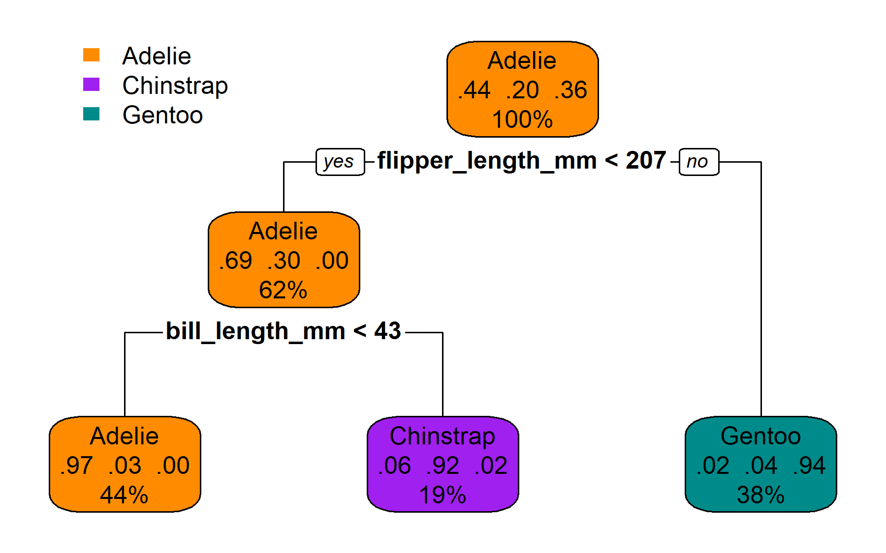

```{r setup, include=FALSE}

options(htmltools.dir.version = FALSE)

knitr::opts_chunk$set(
  echo = FALSE,
  message = FALSE,
  warning = FALSE,
  dpi = 600
)

```

```{r xaringan-themer, include=FALSE, warning=FALSE}

library(xaringanthemer)
library(palmerpenguins)
library(tidyverse)
library(ggforce)
library(rpart)
library(party)
library(rpart.plot)
library(parttree)
library(table.glue)
library(gt)

style_duo_accent(
  primary_color = "#9E7E38",
  secondary_color = "#000000",
  inverse_header_color = "#9E7E38"
)

penguins <- drop_na(penguins)

```


## Overview

- What is a random forest?

    + Decision trees
    
    + Ensemble learning
    
- Oblique random survival forest (ORSF)

    + Strengths/weaknesses
    
    + Benchmark
    
- ORSF in the wild

    + Heart failure risk prediction
    
    + Allograft loss risk prediction

.footnote[slides are available online at https://bcjaeger.github.io/seminar---obliqueRSF/]

---
class: inverse, center, middle

# What is a random forest?

---
background-image: url(img/penguins.png)
background-size: 45%
background-position: 85% 72.5%

## Decision trees

- Frequently used in supervised learning.

- Partitions the space of predictor variables.

- Can be used for classification, regression, and survival analysis. 

.pull-left[
We'll demonstrate the mechanics of decision trees by developing a prediction rule to classify penguin<sup>1</sup> species (chinstrap, gentoo, or adelie) based on bill and flipper length.
]

.footnote[
<sup>1</sup>Data were collected and made available by [Dr. Kristen Gorman](https://www.uaf.edu/cfos/people/faculty/detail/kristen-gorman.php) and the [Palmer Station](https://pal.lternet.edu/), a member of the [Long Term Ecological Research Network](https://lternet.edu/).
]

---

Dimensions for Adelie, Chinstrap and Gentoo Penguins at Palmer Station

```{r fig_penguins_nopart, fig.align='center', fig.height=5}

ggplot(data = penguins) +
  aes(x = flipper_length_mm, y = bill_length_mm, label = species) +
  geom_point(aes(color = species, shape = species),
             size = 3,
             alpha = 0.8) +
  geom_mark_ellipse(aes(color = species, fill = species), alpha = 0.075) +
  theme_minimal() +
  scale_color_manual(values = c("darkorange","purple","cyan4")) +
  scale_fill_manual(values = c("darkorange","purple","cyan4")) +
  labs(x = "\nFlipper length, mm",
       y = "Bill length, mm\n",
       color = "Penguin species",
       shape = "Penguin species") +
  coord_cartesian(ylim = c(30, 70),
                  xlim = c(170, 235)) +
  theme(panel.grid = element_blank(),
        legend.position = '')

```

---

Partition all the penguins into flipper length < 207 or ≥ 207 mm

```{r fig_penguins_part1, fig.align='center', fig.height=5}

mdl_tree <- rpart(formula = species ~ flipper_length_mm + bill_length_mm,
                  data = penguins, 
                  control = rpart.control(maxdepth = 1))


ggplot(data = penguins) +
  aes(x = flipper_length_mm, y = bill_length_mm, label = species) +
  geom_point(aes(color = species, shape = species),
             size = 3,
             alpha = 0.8) +
  geom_parttree(data = mdl_tree, aes(fill=species), alpha = 0.1) +
  theme_minimal() +
  scale_color_manual(values = c("darkorange","purple","cyan4")) +
  scale_fill_manual(values = c("darkorange","cyan4")) +
  labs(x = "\nFlipper length, mm",
       y = "Bill length, mm\n",
       color = "Penguin species",
       shape = "Penguin species") +
  coord_cartesian(ylim = c(30, 70),
                  xlim = c(170, 235)) +
  theme(panel.grid = element_blank(),
        legend.position = '')


```

---

Partition penguins on the left side into into bill length < 43 or ≥ 43 mm

```{r fig_penguins_part2, fig.align='center', fig.height=5}

mdl_tree <- rpart(formula = species ~ flipper_length_mm + bill_length_mm,
                  data = penguins, 
                  control = rpart.control(maxdepth = 2))

ggplot(data = penguins) +
  aes(x = flipper_length_mm, y = bill_length_mm, label = species) +
  geom_point(aes(color = species, shape = species),
             size = 3,
             alpha = 0.8) +
  geom_parttree(data = mdl_tree, aes(fill=species), alpha = 0.1) +
  theme_minimal() +
  scale_color_manual(values = c("darkorange","purple","cyan4")) +
  scale_fill_manual(values = c("darkorange","purple","cyan4")) +
  labs(x = "\nFlipper length, mm",
       y = "Bill length, mm\n",
       color = "Penguin species",
       shape = "Penguin species") +
  coord_cartesian(ylim = c(30, 70),
                  xlim = c(170, 235)) +
  theme(panel.grid = element_blank(),
        legend.position = '')


# ---
# background-image: url(img/penguins_logo.png)
# background-position: 95% 5%
# background-size: 110px 120px
# layout: true

```

---

The same partitions, visualized as a binary tree.

```{r fig_penguins_tree_classif, fig.align='center', out.width='100%'}



# png(res = 300,
#     width = 6,
#     height = 3.75,
#     units = 'in',
#     filename = 'rpart_plot_classif.png')
# 
# rpart.plot::rpart.plot(mdl_tree,
#                        box.palette = list("darkorange","purple","cyan4"))
# 
# dev.off()

```

Node text, top to bottom: predicted class type; predicted class probability; percentage of data in node;

---

For survival trees, the Kaplan-Meier curve or cumulative hazard function is calculated in each terminal node.

```{r fig_penguins_tree_surv, fig.align='center', out.width='100%'}


# penguins_sim <- penguins %>%
#   mutate(
#     time_mean = if_else(
#       bill_length_mm < 40,
#       true = 40,
#       false = 20
#     ),
#     time = rnorm(n = n(), mean = time_mean, sd = 10),
#     time = pmax(time, 2),
#     status = rbinom(n = n(), size = 1, prob = 0.75)
#   )
# 
# library(party)
# 
# png(res = 300,
#     width = 6,
#     height = 3.75,
#     units = 'in',
#     filename = 'rpart_plot_surv.png')
# 
# mdl_ctree <-
#   ctree(formula = Surv(time, status) ~ bill_length_mm, 
#         data = penguins_sim,
#         controls = ctree_control(maxdepth = 1))
# 
# plot(
#   mdl_ctree,
#   inner_panel = node_inner(mdl_ctree, pval = FALSE)
# )
# 
# dev.off()

```

Note: the survival outcomes are simulated

---

With oblique splits, partitions do not need to be rectangles

```{r fig_penguins_part2_oblique, fig.align='center', fig.height=5}

x_delta <- 206.5 - 170
y_delta <- 46 - 40

slope <- y_delta / x_delta
intercept <- 46 - 206.5 * slope

text_lower <-
  table_glue("bill length - {slope} * flipper length < {intercept}")
text_upper <-
  table_glue("bill length - {slope} * flipper length \u2265 {intercept}")

data_poly <- tribble(
  ~flipper_length_mm, ~bill_length_mm    , ~species,
  170               ,  30                , 'Adelie',
  206.5             ,  30                , 'Adelie',
  206.5             ,  46                , 'Adelie',
  170               ,  40                , 'Adelie',
  170               ,  40                , 'Chinstrap',
  206.5             ,  46                , 'Chinstrap',
  206.5             ,  70                , 'Chinstrap',
  170               ,  70                , 'Chinstrap',
  206.5             ,  30                , 'Gentoo',
  235               ,  30                , 'Gentoo',
  235               ,  70                , 'Gentoo',
  206.5             ,  70                , 'Gentoo',
)

ggplot(data = penguins) +
  aes(x = flipper_length_mm, y = bill_length_mm, label = species) +
  geom_polygon(data = data_poly, 
               aes(fill = species, group = species),
               alpha = 0.2,
               col = 'black') +
  geom_point(aes(color = species, shape = species),
             size = 3,
             alpha = 0.8) +
  # geom_abline(slope = slope, intercept = intercept, col = 'red')
  geom_text(
    data = tibble(flipper_length_mm = c(172, 172), 
                  bill_length_mm = c(68, 32), 
                  species = c(text_upper, text_lower)),
    hjust = 0
  ) + 
  theme_minimal() +
  scale_color_manual(values = c("darkorange","purple","cyan4")) +
  scale_fill_manual(values = c("darkorange","purple","cyan4")) +
  labs(x = "\nFlipper length, mm",
       y = "Bill length, mm\n",
       color = "Penguin species",
       shape = "Penguin species") +
  coord_cartesian(ylim = c(30, 70),
                  xlim = c(170, 235)) +
  scale_x_continuous(expand = c(0,0), breaks = c(180, 200, 220)) + 
  scale_y_continuous(expand = c(0,0)) +
  theme(panel.grid = element_blank(),
        legend.position = '')

```

---

## Ensemble learning

Decision trees have been studied in thousands of peer reviewed articles and dozens of textbooks. Tl;dr: single trees are okay but not great at prediction.
- Leo Breiman introduced the idea of ensemble learning through bagging (bootstrap aggregating).<sup>1</sup>
    + Form an ensemble of 'weak learners' that are de-correlated by fitting each to a bootstrapped replicate of the data.
    + Individually, the learners give poor answers, but the collective wisdom of the ensemble is substantial.
    + e.g., myself and friends in graduate school

.footnote[<sup>1</sup>Breiman, Leo. "Bagging predictors." Machine learning 24.2 (1996): 123-140.]

---

## Ensemble learning

Decision trees have been studied in thousands of peer reviewed articles and dozens of textbooks. Tl;dr: single trees are okay but not great at prediction.

- Leo Breiman introduced the idea of ensemble learning through bagging (bootstrap aggregating).<sup>1</sup>
- Later, Leo Breiman tweaked the idea of bagging by restricting candidate variables for splitting a node to a random subset.
    + This modification created the random forest!<sup>2</sup>

.footnote[<sup>1</sup>Breiman, Leo. "Bagging predictors." Machine learning 24.2 (1996): 123-140.<br/><sup>2</sup>Breiman, Leo. "Random forests." Machine learning 45.1 (2001): 5-32.]


---

## Ensemble learning

Decision trees have been studied in thousands of peer reviewed articles and dozens of textbooks. Tl;dr: single trees are okay but not great at prediction.

- Leo Breiman introduced the idea of ensemble learning through bagging (bootstrap aggregating).<sup>1</sup>
- Later, Leo Breiman tweaked the idea of bagging by restricting candidate variables for splitting a node to a random subset.<sup>2</sup>
- Even later, random survival forests were developed.<sup>3</sup>

.footnote[<sup>1</sup>Breiman, Leo. "Bagging predictors." Machine learning 24.2 (1996): 123-140.<br/><sup>2</sup>Breiman, Leo. "Random forests." Machine learning 45.1 (2001): 5-32.<br/><sup>3</sup>Ishwaran, Hemant, et al. "Random survival forests." Annals of Applied Statistics 2.3 (2008): 841-860.]

---

## Ensemble learning

Decision trees have been studied in thousands of peer reviewed articles and dozens of textbooks. Tl;dr: single trees are okay but not great at prediction.

- Leo Breiman introduced the idea of ensemble learning through bagging (bootstrap aggregating).<sup>1</sup>
- Later, Leo Breiman tweaked the idea of bagging by restricting candidate variables for splitting a node to a random subset.<sup>2</sup>
- Even later, random survival forests were developed.<sup>3</sup>
- Even more later, I made the oblique random survival forest.<sup>4</sup>

.footnote[<sup>1</sup>Breiman, Leo. "Bagging predictors." Machine learning 24.2 (1996): 123-140.<br/><sup>2</sup>Breiman, Leo. "Random forests." Machine learning 45.1 (2001): 5-32.<br/><sup>3</sup>Ishwaran, Hemant, et al. "Random survival forests." Annals of Applied Statistics 2.3 (2008): 841-860.<br/><sup>4</sup>Jaeger, Byron C., et al. "Oblique random survival forests." Annals of Applied Statistics 13.3 (2019): 1847-1883.]

---
class: inverse, center, middle

# Oblique random survival forest (ORSF)

---

## Oblique random survival forest (ORSF)

__Definition__: Ensemble of oblique survival decision trees grown with Leo Breiman's original protocol for random forests.

__Strengths__:

- ORSF directly models right censored time-to-event data, which are very common in medical settings.

- oblique splitting increases efficiency, which makes ORSF ideal for smaller cohort studies.

- risk prediction just works. (No need to estimate hazard functions).

__Weaknesses__

- slow (finding linear combinations takes time).

- variable importance does not work as well for oblique splits.

---

Benchmark experiment from Jaeger et al. (ORSF vs. all y'all):

```{r fig_orsf_overall_comp, fig.height=5.2, dpi=300}

cval <- c("ORSF",
          "ORSF.CV",
          "CIF",
          "RSF",
          "XgBoost",
          "CoxBoost",
          "Lasso",
          "Ridge",
          "Step")

pmat <- read_rds('data/data_overall_comp.rds') %>%
  mutate(
    m1 = factor(m1, levels = cval),
    m2 = factor(m2, levels = cval),
    z = cut(
      z,
      breaks = c(0, 0.05, 0.10, 1, 2),
      include.lowest = T,
      labels = c('  p < 0.05  ', 
                 '  p < 0.10  ', 
                 '  p \u2265 0.10  ',
                 'Average \nRanking')
    ),
    zlab_left = str_extract(zlab, '.+ \n'),
    zlab_right = str_extract(zlab, '\n .+'),
    zlab = str_replace(zlab, '.+ \n .+', ""),
    across(c(zlab_left, zlab_right), str_remove, '\n | \n')
  )
  
pmat$zlab[pmat$zlab=='0.000']='<0.001'

fig_overall_comp <- ggplot(pmat) +
  aes(x = m1,y = m2,fill = z,label = zlab) +
  geom_tile(color = 'black') +
  geom_text(size = 3) +
  geom_text(
    aes(label = zlab_left), 
    nudge_x = -1/4,
    nudge_y = 1/4
  ) + 
  geom_text(
    aes(label = zlab_right),
    nudge_x = 1/4,
    nudge_y = -1/4
  ) +
  geom_abline(slope = 1,
              intercept = 0,
              col = 'black') +
  scale_fill_manual(
    values = c('darkorchid2', 
               'orchid2', 
               'skyblue', 
               'white')
  ) +
  theme_bw() +
  labs(x = '\nComparisons of Concordance ranks',
       y = '',
       fill = '',
       title = 'Comparisons of Brier score ranks\n') +
  theme(legend.position = 'right',
        panel.grid = element_blank(),
        axis.text = element_text(size = 8),
        text = element_text(face = 'bold', size = 8),
        panel.border = element_blank(),
        plot.title = element_text(face = "bold",
                                      size = rel(1), hjust = 0.5))

fig_overall_comp

```

---

How ORSF compares to others in terms of the Brier score

```{r fig_orsf_overall_comp_focus_left, fig.height=5.2, dpi=300}

fig_overall_comp +
  geom_rect(xmin = 1 / 2,
            xmax = 3 / 2,
            ymin = 1 / 2,
            ymax = 19 / 2,
            col = 'red',
            size = 1,
            alpha = 0,
            show.legend = FALSE)

```

---

How ORSF compares to others in terms of model concordance.

```{r fig_orsf_overall_comp_focus_right, fig.height=5.2, dpi=300}

fig_overall_comp +
  geom_rect(xmin = 1 / 2,
            ymax = 3 / 2,
            ymin = 1 / 2,
            xmax = 19 / 2,
            col = 'red',
            size = 1,
            alpha = 0,
            show.legend = FALSE)

```

---
class: inverse, center, middle

# ORSF in the wild

---

External validation of 10-year risk prediction models for heart failure in the ARIC (Atherosclerosis risk in communities) and MESA/DHS (Multi-Ethnic Study of Atherosclerosis/Dallas Heart Study) cohorts.

.left-column[
__Source:__ _Development and Validation of Machine Learning-based Race-specific Models to Predict 10-year Risk of Heart Failure: A Multi-cohort Analysis_

Matthew W Segar et al. [Circulation](https://doi.org/10.1161/circ.142.suppl_3.196) 2020; 142:A196
]


<!-- Nambi V, Liu X, Chambless LE, et al. Troponin T and N-terminal pro-B-type natriuretic peptide: a biomarker approach to predict heart failure risk--the atherosclerosis risk in communities study. Clin Chem. 2013;59(12):1802-1810. -->
<!-- 23.	Khan SS, Ning H, Shah SJ, et al. 10-Year Risk Equations for Incident Heart Failure in the General Population. J Am Coll Cardiol. 2019;73(19):2388-2397. -->

.right-column[

```{r results = 'asis'}

data_segar <- tibble(
  grp = rep(c("Black adults", "White adults"), each = 3),
  mdl = rep(c("ORSF", "Nambi et al", "Khan et al"), 2),
  c_aric = c(0.81, 0.77, 0.71, NA, NA, NA),
  p_aric = c(0.24, 0.10, 0.79, NA, NA, NA),
  c_meds = c(0.83, 0.80, 0.78, 0.82, 0.79, 0.80),
  p_meds = c(0.17, 0.001, 0.54, 0.15, 0.001, 0.40)
)

library(knitr)
library(kableExtra)

row_labels <- table(data_segar$grp)

col_names <- c('Model', 
               'C-statistic',
               'P-value<sup>1</sup>',
               'C-statistic',
               'P-value<sup>1</sup>')

data_segar %>% 
  select(-grp) %>% 
  mutate(across(ends_with('aric'), table_value)) %>% 
  kable(align = 'lcccc',
        col.names = col_names,
        escape = FALSE) %>% 
  kable_styling() %>%
  add_header_above(c(" " = 1, "ARIC" = 2, "MESA/DHS" = 2)) %>% 
  pack_rows(index = row_labels, indent = FALSE)

# gt(data_segar, rowname_col = 'mdl', groupname_col = 'grp') %>% 
#   fmt_missing(columns = c('c_aric', 'p_aric')) %>% 
#   tab_spanner(label = 'ARIC', columns = c('c_aric', 'p_aric')) %>% 
#   tab_spanner(label = 'MESA/DHS', columns = c('c_meds', 'p_meds')) %>% 
#   cols_label(
#     c_aric = 'C-statistic',
#     p_aric = html('P-value<sup>1</sup>'),
#     c_meds = 'C-statistic',
#     p_meds = html('P-value<sup>1</sup>')
#   ) %>% 
#   cols_align(columns = c('c_aric', 'p_aric', 'c_meds', 'p_meds'), 
#              align = 'center')

```

<sup>1</sup>From modified Nam-D'Agostino test for mis-calibration

]

---

Internal validation of 1-year risk prediction models for allograft loss or mortality in the PHTS (Pediatric Heart Transplant Society) registry.

.left-column[

__Continuation of:__ _Risk Factors for One-year Mortality and Allograft Loss in Pediatric Heart Transplant Patients Using Machine Learning_

Bethany L Wisotzkey et al. [_Circulation_](https://www.ahajournals.org/doi/abs/10.1161/circ.142.suppl_3.14239). 2020; 142:A14239

]

.right-column[

```{r fig_orsf_phts_auc, fig.height=5.2, dpi=300}

read_rds("data/data_phts_auc.rds") %>% 
  mutate(model = fct_reorder2(model, .x = n_predictors, .y = value_est)) %>% 
  ggplot() + 
  aes(x = n_predictors, 
      y = value_est,
      fill = model,
      color = model) + 
  geom_line(show.legend = FALSE) +
  geom_point(size = 3.5, shape = 21, color = 'black') +
  theme_bw() + 
  theme(text = element_text(size = 12),
        panel.grid.major.x = element_blank(),
        panel.grid.minor.x = element_blank(),
        panel.border = element_blank()) + 
  labs(
    x = 'Number of predictor variables used in prediction model',
    y = 'Model concordance (C-statisic)',
    fill = 'Prediction model\ndeveloped using'
  ) +
  scale_fill_manual(
    values = c('purple', 'forestgreen', 'orange', 'grey')
  ) + 
  scale_color_manual(
    values = c('purple', 'forestgreen', 'orange', 'grey')
  ) +
  scale_x_sqrt(breaks = c(5, 10, 15, 20, 35, 50, 75))

```

Data presented are median values from 500 replications of Monte-Carlo cross validation

]

---

Internal validation of 1-year risk prediction models for allograft loss or mortality in the PHTS (Pediatric Heart Transplant Society) registry.

.left-column[

__Continuation of:__ _Risk Factors for One-year Mortality and Allograft Loss in Pediatric Heart Transplant Patients Using Machine Learning_

Bethany L Wisotzkey et al. [_Circulation_](https://www.ahajournals.org/doi/abs/10.1161/circ.142.suppl_3.14239). 2020; 142:A14239

]

.right-column[

```{r fig_orsf_phts_gnd, fig.height=5.2, dpi=300}

read_rds("data/data_phts_gnd.rds") %>% 
  mutate(model = factor(
    model, 
    levels = c(
      "Proportional\nhazards",
      "Oblique random\nsurvival forest", 
      "Standard random\nsurvival forest",
      "Gradient\nboosting"
    )
  )) %>% 
  ggplot() + 
  aes(x = n_predictors, 
      y = value_est,
      fill = model,
      color = model) + 
  geom_line(show.legend = FALSE) +
  geom_point(size = 3.5, shape = 21, color = 'black') +
  theme_bw() + 
  theme(text = element_text(size = 12),
        panel.grid.major.x = element_blank(),
        panel.grid.minor.x = element_blank(),
        panel.border = element_blank()) + 
  labs(
    x = 'Number of predictor variables used in prediction model',
    y = 'P-value for mis-calibration (modified Nam-D\'Agostino)',
    fill = 'Prediction model\ndeveloped using'
  ) +
  scale_fill_manual(
    values = c('grey', 'purple', 'orange', 'forestgreen')
  ) + 
  scale_color_manual(
    values = c('grey', 'purple', 'orange', 'forestgreen')
  ) +
  scale_x_sqrt(breaks = c(5, 10, 15, 20, 35, 50, 75))

```

Data presented are median values from 500 replications of Monte-Carlo cross validation

]

---

```{r}
data("pbc",package='survival')
pbc$status[pbc$status>=1]=pbc$status[pbc$status>=1]-1
pbc$id=NULL
fctrs<-c('trt','ascites','spiders','edema','hepato','stage')
for(f in fctrs)pbc[[f]]=as.factor(pbc[[f]])
pbc=na.omit(pbc)
```


## What I've heard from friends

The only reason ORSF has been used in recent projects is because others have been able to use it through the R package, `obliqueRSF`.

`obliqueRSF` does two things particularly well: 

- Develop accurate risk prediction models

- Apply them to new data.

.pull-left[

```{r, echo = TRUE, results='hide'}

library(obliqueRSF)

orsf_fit <- 
  ORSF(data = pbc[-c(1:5), ], 
       time = 'time', 
       status = 'status', 
       ntree = 5)

```

]

.pull-right[

```{r, echo = TRUE}

predict(orsf_fit, 
        newdata = pbc[1:5, ], 
        times = 500)

```


]

---
class: right, top
background-image: url(img/collaborators_orsf.png)
background-size: contain

# Thank you!

